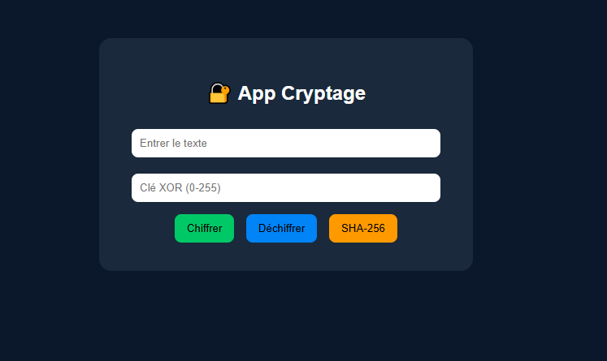

# 🔐 Crypto Web App

A simple and modern web application built with Flask for encryption and hashing.

---
##  Features

- 🔐 XOR Encryption
- 🔓 XOR Decryption
- SHA-256 Hashing
---

## 🛠️ Technologies Used

- Python 🐍
- Flask
- HTML / CSS

---

## 📸 Preview



---

## ▶️ Run the Project

```bash
pip install flask
python app.py
```
## Then open:

```bash
http://127.0.0.1:5000/
```
---
## 👩‍💻 Author

Chaimaa Matrag
